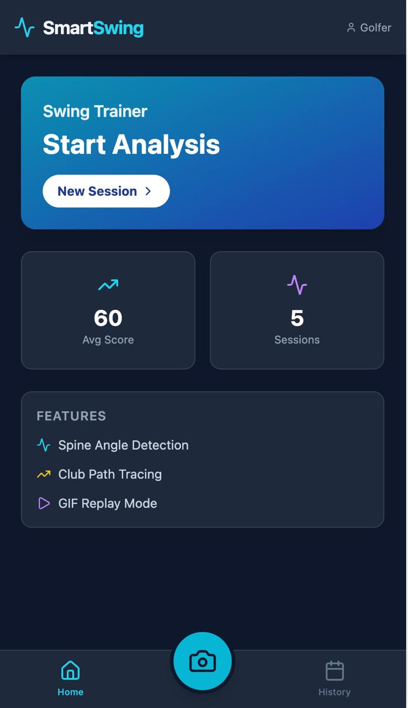
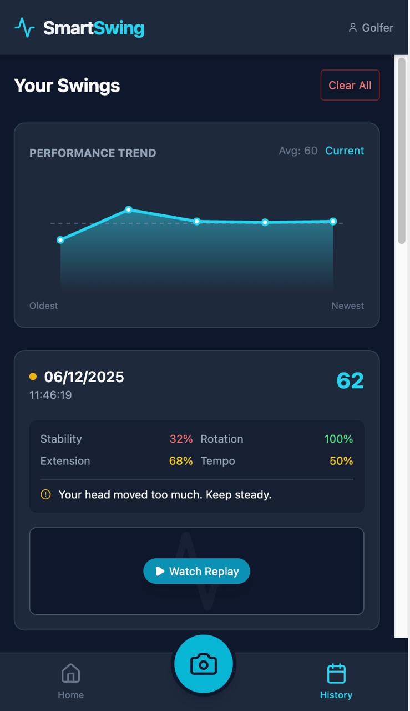

# SmartSwing – Mobile-First Golf Swing Analysis

**Developed as part of an Athena Education assignment.**

## Overview

SmartSwing is a mobile-first AI application that analyzes a golfer’s swing in real time using on-device computer vision. The system detects key biomechanical patterns such as posture, stability, shoulder rotation, and arm extension, and then generates a Swing Accuracy Score along with personalized feedback. Users can record sessions, watch replay videos with overlays, and track historical performance trends over time.

This project was implemented using pose estimation, canvas-based overlays, IndexedDB storage, and in-browser video processing to ensure fast, low-cost, offline capability on mobile devices.

**Assignment description reference:** ASSIGNMENT

## Features

* **Real-time pose estimation** using the smartphone camera.
* **Frame-by-frame biomechanical analysis** (stability, rotation, extension, tempo).
* **Visual overlays** for spine angle and hand path.
* **Automatic scoring** using weighted metrics.
* **Replay recording** stored locally via IndexedDB.
* **History view** with trend graph and session insights.
* **Upload-video mode** with identical analysis workflow.

## Code Structure

```text
src/
│
├── App.jsx                 
│   Main application file containing navigation, layout, routing, and the mobile-first container.
│
├── views/
│   ├── HomeView           
│   │   Displays summary stats, quick actions, and feature list.
│   │
│   ├── RecordView         
│   │   Core logic: camera streaming, pose detection, canvas overlays,
│   │   scoring, analysis, MediaRecorder integration, and session saving.
│   │
│   ├── HistoryView        
│       Loads swing sessions, renders performance graph, and enables replay playback.
│
├── utils/
│   ├── indexedDB.js       
│   │   Handles large video storage in the browser using IndexedDB.
│   │
│   ├── geometry.js        
│   │   Includes midpoint, slope, and path utilities.
│   │
│   └── scriptLoader.js    
│       Loads MediaPipe scripts asynchronously.
│
public/
    Static assets, icons, and build files.

```

---

## Application Workflow  

### 1. User Interface 



The UI presents a mobile-first layout with three main sections:

- Home  
- Record  
- History  

Navigation remains at the bottom for thumb reachability, and action buttons are large and easy to tap. Users can begin analysis immediately with the central camera button.

### 2. Real-Time Capture and Analysis 
The real-time workflow follows these steps:

<video src="https://github.com/Karthikeya-ai-glitch/Athena-assignment-SmartSwing/raw/main/Athena_demo.mp4" controls="controls" style="max-width: 640px;">
</video>

1. User selects Live Camera or Upload Video.  
2. MediaPipe Pose processes each frame to extract landmarks.  
3. Canvas overlays draw spine lines, connectors, and hand paths.  
4. Biomechanical metrics are accumulated:  
   - Head stability  
   - Shoulder rotation slope  
   - Arm extension  
   - Tempo based on frame count  


5. A composite visual (video + overlay) is recorded using the canvas stream.  
6. Metrics are converted into a weighted Swing Accuracy Score.  
7. Replay video is saved in IndexedDB, and session metadata is saved in localStorage.

### 3. System Architecture   
The architecture follows this pipeline:

Input → Pose Estimation → Analysis Engine → Scoring Module → Feedback Generator → Replay Recorder → Storage Layer → History & Replay Viewer

This visual represents the full cycle from camera frame to user insights.

---

## Why SmartSwing Is Mobile-First  

### Interface Design  
- Layout restricted to `max-w-md` to match mobile screen dimensions.  
- Large tap-friendly buttons and clear spacing.  
- Bottom navigation designed for one-handed use.  
- Scrollable, vertically stacked UI optimized for small displays.

### Technical Architecture  
- Entire workflow runs **on-device**, ideal for smartphones.  
- Lightweight MediaPipe models chosen for mobile performance.  
- Canvas rendering adapts to mobile resolutions using object-fit behavior.  
- IndexedDB enables large video storage without backend services.  
- MediaRecorder API works natively on mobile browsers for recording annotated sessions.  
- No server dependency ensures fast, low-data usage suitable for mobile networks.

These decisions make SmartSwing not just mobile-friendly but truly mobile-first in both design and execution.

---

## Tech Stack and Rationale  

### MediaPipe Pose  
Used for lightweight, real-time joint detection optimized for mobile devices.

### Canvas Overlay  
Provides customizable, low-cost rendering of biomechanics directly in the browser.

### MediaRecorder API  
Captures annotated swing replays without external tools.

### IndexedDB  
Stores large video files locally, overcoming mobile storage limitations.

### LocalStorage  
Stores scores, timestamps, and performance history.

### Vite  
Chosen for fast development and minimal build overhead.

Drive Link : 
---

## Conclusion  
SmartSwing delivers an efficient, mobile-first golfing analysis experience using pure browser-based AI. The app performs real-time pose detection, scoring, and video replay generation directly on the user's device, fully satisfying the requirements of the Athena Education assignment.

